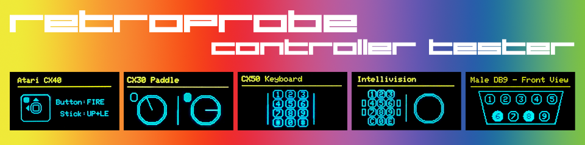

# RetroProbe - Retro Controller Tester

&nbsp;&nbsp;

RetroProbe is a tool for testing retro-gaming controllers. Specifically, those using a 9-pin DSUB (DE9, sometimes erroneously called DB9) connections.

This currently includes controllers such as the classic Atari CX40 joystick, CX30 paddle and CX21 video touch pad, as well as Intellivision controllers and raw DE9 testing/probing.

The design is modular and extensible, with plans to extend the number and types of controllers supported over time.

*RetroProbe was inspired by [@MasterMIB](https://github.com/rodineyhm)'s "[IntvTestBox](https://github.com/rodineyhm/IntvTestBox)", an Intellivision controller tester, from which it also borrows a couple functions.*

## Hardware & Environment
RetroProbe is built on a Raspberry Pi Pico, driving a 0.96" 1-bit color OLED 128x64 pixel I2C display, requires a pair of momentary switches, a male DE9 connector and a pair of 1MΩ resistors.

This runs [Adafruit](https://www.adafruit.com)'s [Circuit Python](https://github.com/adafruit/circuitpython) (a modified form of Micro Python).

### Assembly
Assembly instructions will follow, and will be in the "assembly" folder.  This can be built on a prototyping/breadboard without any soldering with inexpensive parts easily available from multiple sources (including Amazon).

### Installation
A ready-to-run flash image (.UF2) is provided under "[Releases](https://github.com/idunmore/retroprobe/releases)".  Use the .zip file indicated for your specific version of the Pi Pico (or clone).

 - While holding down the "BOOTSEL" button, connect your Raspberry Pi Pico (or clone) to your computer via a USB cable.
 
 - A removable drive called "RPI-PI2" will be mounted.

 - Copy the .UF2 file to the root directory of the "RPI-PI2" device (this will take up to a couple of minutes; you may not see any progress until it completes).

 - The "RPI-PI2" device will automatically unmount/eject itself (you may get a "drive was not safely ejected" message, which you can ignore).

 - Disconnect the Pi Pico from your computer, wait a few seconds, then reconnect it and it will boot and display the "RetroProbe" boot screen.

*RetroProbe is now ready to use.*

 
