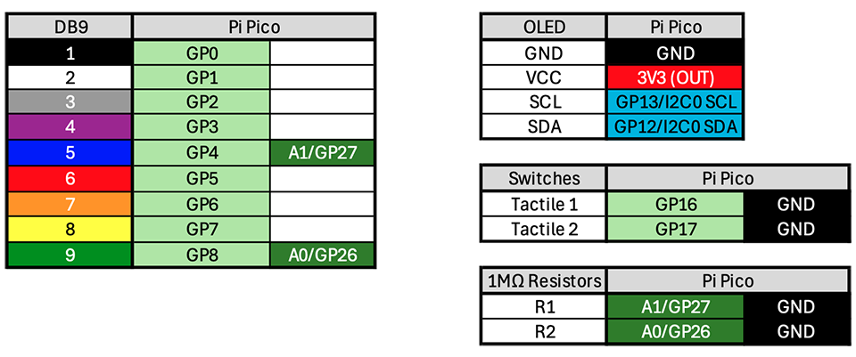
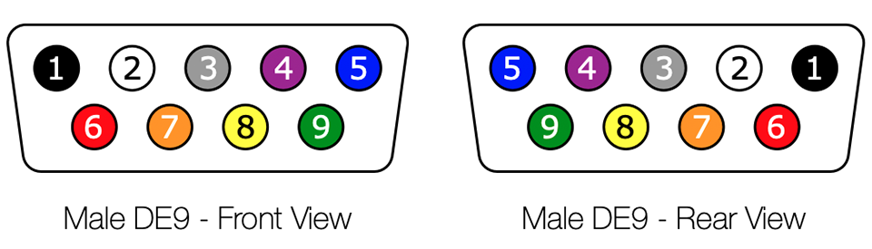
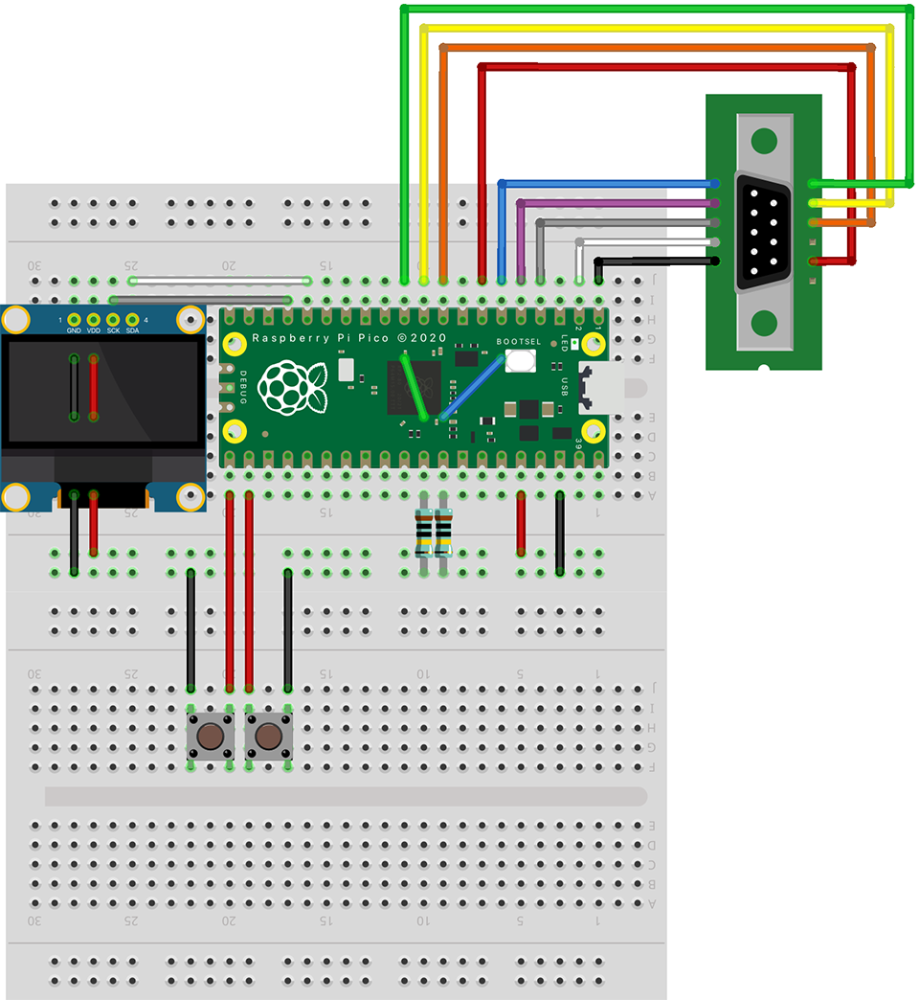
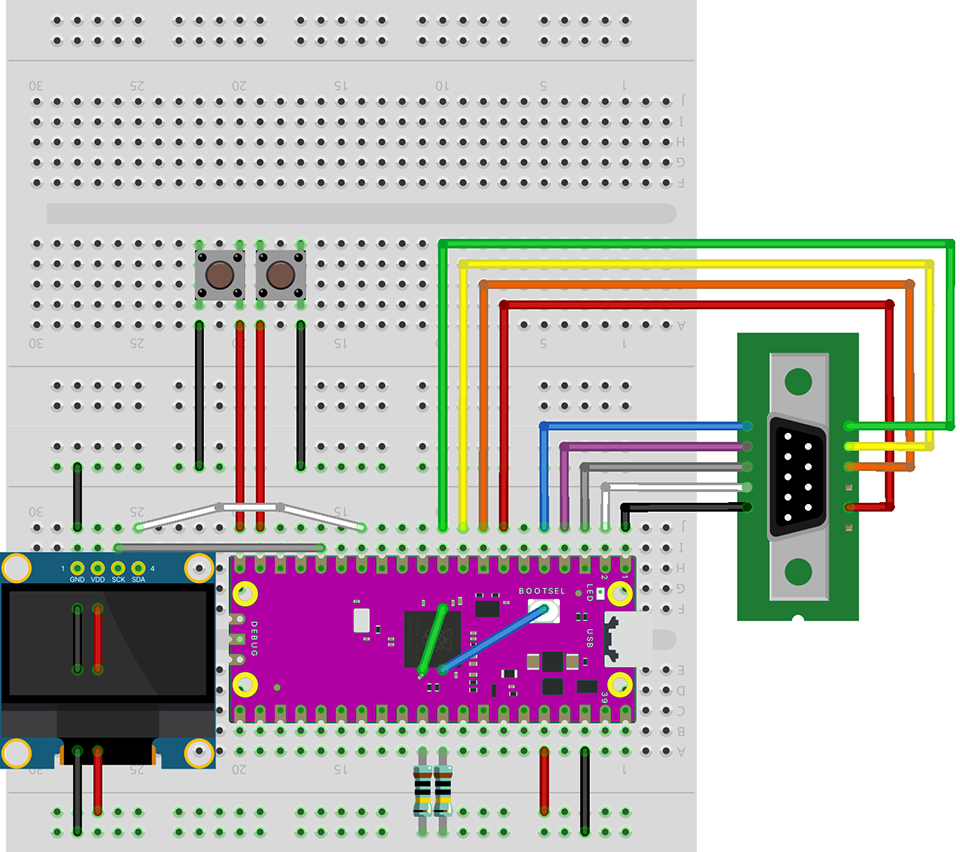

# Assembling RetroProbe

RetroProbe is easily assembled using a minimum number of parts.  It can be built on prototyping shields (solder and solder-less), perf-board, a custom PCB or assembled on a solder-less breadboard.

Connections between the primary components are as follows:

Where **two** connections are indicated in the "Pi Pico" column, those two pins (or the pin and ground) should be connected.  For example, DB9 Pin 1 is connected to GPIO pin 4 (GP4) and in turn to GPIO pin 27 (aka A1).

Connections to the MALE DE9 connector assume pin assignments are depicted below; for convince both front and rear (solder-side) PIN numbers are illustrated:

## Breadboard Assembly
RetroProbe can easily be built on a solder-less breadboard.

Two suggested layouts, that minimize the amount of external wiring required, are shown below.

The first is for the [official Raspberry Pi Pico](https://www.raspberrypi.com/products/raspberry-pi-pico/) RP2040 (green PCB, 2MB flash storage):

The second is for a common, cheaper, clone of the Raspberry Pi Pico RP2040 ([purple PCB](https://www.aliexpress.us/item/3256810075498433.html?gatewayAdapt=glo2usa), 16MB flash storage):

**NOTE:** For the Pi clone assembly, ignore the pin vs. GND pad *shapes* and follow the actual pin designations on the board - this is an artifact of using a standard Pi Pico "part" in the diagram.
